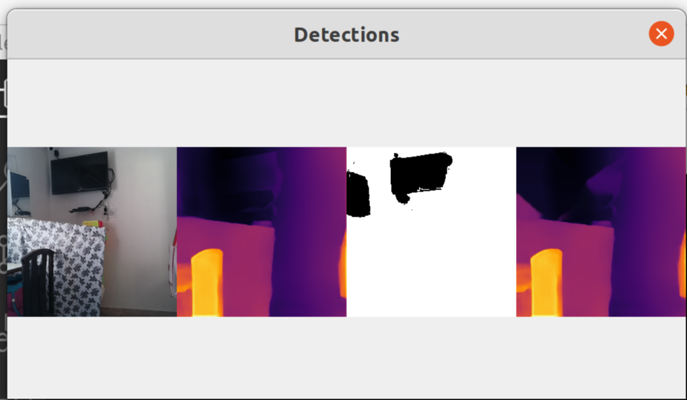

# File Structure:
```
├── Assets
├── GDNet
│   ├── backbone
│   ├── config.py
│   ├── dataset.py
│   ├── gdnet.py
│   ├── infer.py
│   ├── main.py
│   ├── misc.py
│   └── README.md
├── Mirrornet
│   ├── MiDaS.py
│   ├── MirrorNet Midas
│   │   ├── backbone
│   │   ├── config.py
│   │   ├── dataset.py
│   │   ├── infer_local.py
│   │   ├── infer.py
│   │   ├── main.py
│   │   ├── mirrornet.py
│   │   ├── misc.py
│   │   ├── README.md
│   │   └── utils
│   └── mirrornet_oakd.py
├── Models
│   ├── 160.pth
│   ├── 200.pth
│   ├── blob
│   ├── MiDaS_small.bin
│   ├── MiDaS_small.xml
│   ├── nyu_rawdata.pth
│   └── onnx
├── README.md
├── Report.md
└── requirements.txt
```

# Installation:
### 1. Create conda environment:
```
conda create -n mystereos
conda activate mystereos
```
### 2. Install Requirements
```
sudo pip install -r requirements.txt
conda install scikit-image

python3 -m pip list | grep depthai

conda install pytorch torchvision torchaudio cpuonly -c pytorch
```

### 3. Download Model files from [here](https://drive.google.com/file/d/1UnIaeM93dVn-vsykh7cbl0ByQr9Dy37j/view?usp=sharing) and extract it in the parent directory as Mystereos-Spatial-AI/Models
---
## **MirrorNet**:
```
cd Mirrornet
```
### Run only MiDaS depth model 12 FPS

    python MiDaS.py

### Run Mirrornet masking on OAK-D 2 FPS

    mirrornet_OAK-D.py 

### Run MiDaS on OAK-D and Mirrornet locally simultaneously

    cd MirrorNet\ Midas/
    python main.py

### Test Mirrornet on Locally stored images

    cd MirrorNet\ Midas/
    python infer_local.py

## **GDNet**
### Run MiDaS on OAK-D and GDNet locally simultaneously

    cd GDNet
    python main.py

---

# Results:

## **MiDaS Monocular Depth Estimation:**

**FPS:** 13-14 FPS on OAK-D Pro

Flase Depth is being calculated for the virtual background on the laptop screen.

---


The above video shows accurate depth estimation on non reflective surfaces, but incorrect depth on reflective surfaces (mirror), as the person is clearly visible in the depth map of the mirror, which should ideally be a flat surface.

---

## **MiDaS and MirrorNet Masking**
**FPS:** ~1 FPS


**Leftmost image**: RGB image

**2nd from left image**: inaccurate depth map for lambertian surfaces

**3rd from left image:** mask created by mirrornet for reflective surface detected 

**Rightmost image:** Depth Map output after applying mask and post processing

---

The above video shows that the model accurately removes the false depth from the mirror, tho the FPS takes a significant hit.

---
## **MiDaS and GDNet Masking**
**FPS:** ~1 FPS

**Leftmost image**: RGB image

**2nd from left image**: inaccurate depth map for lambertian surfaces

**3rd from left image:** mask created by mirrornet for reflective surface detected 

**Rightmost image:** Depth Map output after applying mask and post processing

---

The above video shows that the model accurately removes the false depth from the mirror, but also creates false depth maps in the absence of a mirror. 

---

# Ackowledgement
