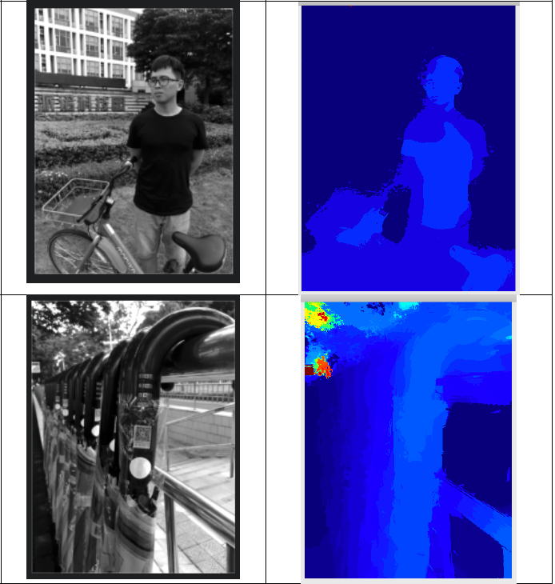

# Mystereos-Spatial-AI

## **Aim:** 
The aim of our project is to improve the depth estimation of Oak-D Pro and othe similar camera systems by solving some major problems including **occlusions**, improving depth estimation of **mirror surfaces** and **Long Range Depth Estimation** using stereo and monocular depth estimation techniques.

---

# Occlusion
## Theory:

## Workflow

## Conclusion

---

# Long Range
## **Theory:**
Use of MCCNN and MCDCNN Neural Networks to increase the long range depth estimation on OAK-D Pro camera.

## **Workflow:**
We ran few inferences on locally stored images, and the results obtained seemed promising, but the inference time was way too long for real-time applications, which is not suitable for our use-case. 

## **Results:**

### **Inference Time:** ~ 30 Mins

---

# **Mirror Surfaces**
## **Theory**
The RGB input images from the camera are passed to **Mirror Detection and Masking** Neural Networks- [MirrorNet](https://mhaiyang.github.io/ICCV2019_MirrorNet/index.html) and [GDNet](https://mhaiyang.github.io/CVPR2020_GDNet/index.html)
These Networks output a Binary Mask in the location of any Mirror, if detected.

Simultaneouly, the RGB image from the camera is also passed to the MiDaS monocular depth estimation model which creates an accurate depth map.

Then the Mask obtained in 1. is applied on the Depth Map, omitting the mirror.

Finally, using post processing techniques, we estimate the depth of the Mirror surface, on the basis of its surroundings.

The Depth Map thus created is free of the error caused by Mirror Surface due to reflection of the objects in front of it.

We can also use the **IR Dot-Projection System** on OAK-D Pro to increase the **low-light** performance.

## **Workflow**
Started with mirror3d
used mirrornet and gdnet  

# Results:
