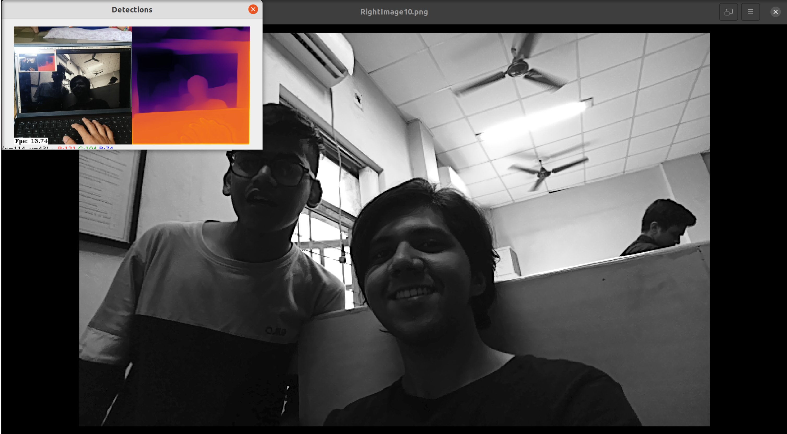
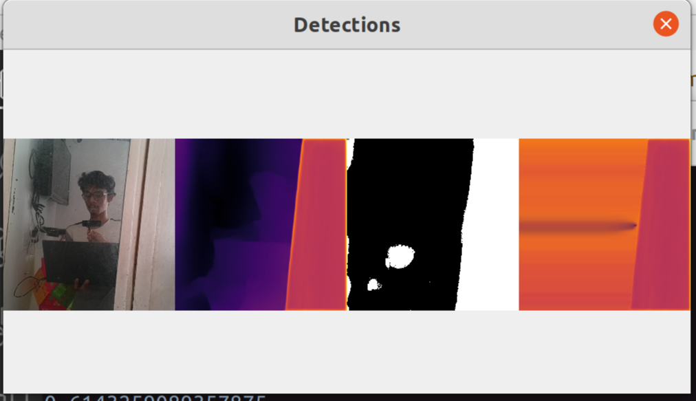

# Mystereos-Spatial-AI

## Table Of Contents:
```
├── Assets
├── GDNet
│   ├── backbone
│   ├── config.py
│   ├── dataset.py
│   ├── gdnet.py
│   ├── infer.py
│   ├── main.py
│   ├── misc.py
│   └── README.md
├── Mirrornet
│   ├── MiDaS.py
│   ├── MirrorNet Midas
│   │   ├── backbone
│   │   ├── config.py
│   │   ├── dataset.py
│   │   ├── infer_local.py
│   │   ├── infer.py
│   │   ├── main.py
│   │   ├── mirrornet.py
│   │   ├── misc.py
│   │   ├── README.md
│   │   └── utils
│   └── mirrornet_oakd.py
├── Models
│   ├── 160.pth
│   ├── 200.pth
│   ├── blob
│   ├── MiDaS_small.bin
│   ├── MiDaS_small.xml
│   ├── nyu_rawdata.pth
│   └── onnx
├── README.md
├── Report.md
└── requirements.txt
```
---


# **Aim:** 
The aim of our project is to improve the depth estimation of Oak-D Pro and othe similar camera systems by solving some major problems including **occlusions**, improving depth estimation of **mirror surfaces** and **Long Range Depth Estimation** using stereo and monocular depth estimation techniques.

---

> # Occlusion
### **Theory:**
Use of [Occlusion Aware Depth Maps](https://paperswithcode.com/paper/learning-occlusion-aware-coarse-to-fine-depth) trained using a combination of stereo and monocular vision.
MonoDepth

### **Workflow**
We explored the various pretrained models like [OCFDnet](https://arxiv.org/abs/2203.10925) and [MonoDepth2](https://arxiv.org/abs/1806.01260), but were unable to extract suitable results on the OAK-D Pro camera.

### **Conclusion**
The IR Dot Projection System on the OAK-D Pro is used to solve the problem of occulsion to some extent.

---

> # Long Range
### **Theory:**
MCCNN and MCDCNN Neural Networks are used to improve the long range depth estimation on OAK-D Pro camera.

### **Workflow:**
We ran few inferences on locally stored images ([Google Colab](https://colab.research.google.com/drive/1hdsLAY-AiK5YD3sXDgfykD-_YJQTkf-P?usp=sharing)), and the results obtained seemed promising, but the inference time was way too long for real-time applications, which is not suitable for our use-case.

### **Results:**
Inference Time: ~30 mins


### **Inference Time:** ~ 30 Mins

---

> # **Mirror and Lambertian Surfaces**
## **Theory**
1. The RGB input images from the camera are passed to **Mirror Detection and Masking** Neural Networks- [MirrorNet](https://mhaiyang.github.io/ICCV2019_MirrorNet/index.html) and [GDNet](https://mhaiyang.github.io/CVPR2020_GDNet/index.html).
   
   These Networks output a Binary Mask in the location of Lambertian surfaces, if detected.

2. Simultaneouly, the same RGB image from the camera is also passed to the [MiDaS](https://arxiv.org/abs/1907.01341v3) monocular depth estimation model which creates a very accurate depth map of the scene.

3. Then the **Mirror-Mask** obtained from MirrorNet and GDNet is applied on the Depth Map; thus, omitting the mirror.

4. Finally, using **Post processing** techniques like inpainting, etc, we estimate the depth of the Mirror surface, on the basis of its surroundings.

The Depth Map thus created is free of the error caused by Mirror and other Lambertian Surface due to the reflection of the objects in front of it.

The **IR Illumination and Dot-Projection System** on OAK-D Pro can also be used to increase the **low-light** performance.

## **Workflow**

> ### [MiDaS](https://arxiv.org/abs/1907.01341v3):
1. Integration in OAK-D Pro using [depthai](https://docs.luxonis.com/en/latest/) pipelining

2. State of the art monocular depth estimation results, running on OAK-D Pro, with ~14 FPS

> ### [Mirror3DNet](https://3dlg-hcvc.github.io/mirror3d/):
1. Inference Results were not good enough for our use-case, as the depth map obtained was not very accurate.
> ### [MirrorNet](https://mhaiyang.github.io/ICCV2019_MirrorNet/index.html):
1. Inference results were good, with proper masks for mirror surfaces being generated.
2. Inference time is very high, but it is good enough for real-time application.

> ### [GDNet](https://mhaiyang.github.io/CVPR2020_GDNet/index.html):
1. Inference results were very good when a mirror is present in the scene, but poor in the absence of a mirror.

2. Inference time is similar to that of MirrorNet.
3. Suitable for applications where mirrors are always present in the frame.

# Results:

## **MiDaS Monocular Depth Estimation:**

**FPS:** 13-14 FPS on OAK-D Pro

Flase Depth is being calculated for the virtual background on the laptop screen.

---


The above video shows accurate depth estimation on non reflective surfaces, but incorrect depth on reflective surfaces (mirror), as the person is clearly visible in the depth map of the mirror, which should ideally be a flat surface.

---

## **MiDaS and MirrorNet Masking**
**FPS:** ~1 FPS


**Leftmost image**: RGB image

**2nd from left image**: inaccurate depth map for lambertian surfaces

**3rd from left image:** mask created by mirrornet for reflective surface detected 

**Rightmost image:** Depth Map output after applying mask and post processing

---

The above video shows that the model accurately removes the false depth from the mirror, tho the FPS takes a significant hit.

---
## **MiDaS and GDNet Masking**
**FPS:** ~1 FPS

**Leftmost image**: RGB image

**2nd from left image**: inaccurate depth map for lambertian surfaces

**3rd from left image:** mask created by mirrornet for reflective surface detected 

**Rightmost image:** Depth Map output after applying mask and post processing

---

The above video shows that the model accurately removes the false depth from the mirror, but also creates false depth maps in the absence of a mirror. 

---

# Ackowledgement
